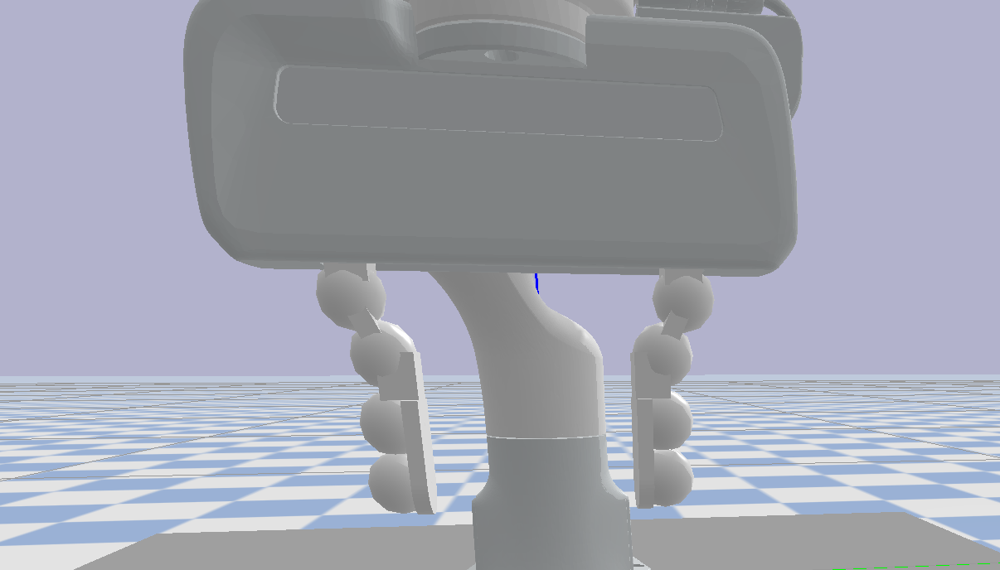

# Custom Franka Panda environment in PyBullet

### Functionalities

Some sample environments are provided in ```panda_gym``` that follow the OpenAI Gym environment style.  In ```script```, ```test.py``` provides a minimal working example, and ```run_gym.py``` provides an example of running vectorized environments using [Stable Baselines 3](https://stable-baselines3.readthedocs.io/en/master/guide/vec_envs.html). 

A Differential IK controller is implemented in ```grasp_env```, which supports a wide variety of orientation input (Euler/Quaternion/Azimuthal).

The original gripper fingers from Franka are a bit short. Instead, we use a longer gripper finger model from [Doug Morrison](https://dougsm.com/).  

To simplify collision checking in PyBullet, the arm URDF uses multiple spheres instead of the official mesh file for each link as collision shapes. The URDF is modified from the one provided in Drake; see [issue](https://github.com/RobotLocomotion/drake/pull/13012). At the gripper finger, the collision shapes look like this:



### Lessons
1. I often find that contact properties of object (like a mug) with multiple convex parts in a single obj file are not realistic in PyBullet (I do not know the reason). From my experience, collisions are more realistic with objects from a URDF file with convex parts as links and fixed joints between them. [```export_urdf```](https://trimsh.org/trimesh.exchange.urdf.html) in Trimesh works well.


### Limitations

1. PyBullet only supports at most one texture from each obj file, which makes the textures on the Franka arm not rendered properly. See [issue](https://github.com/bulletphysics/bullet3/discussions/3581). The workaround is to use the ```obj2sdf``` utility from PyBullet, but it is quite a hassle with multiple links in the URDF. It is probably workable with some efforts.

